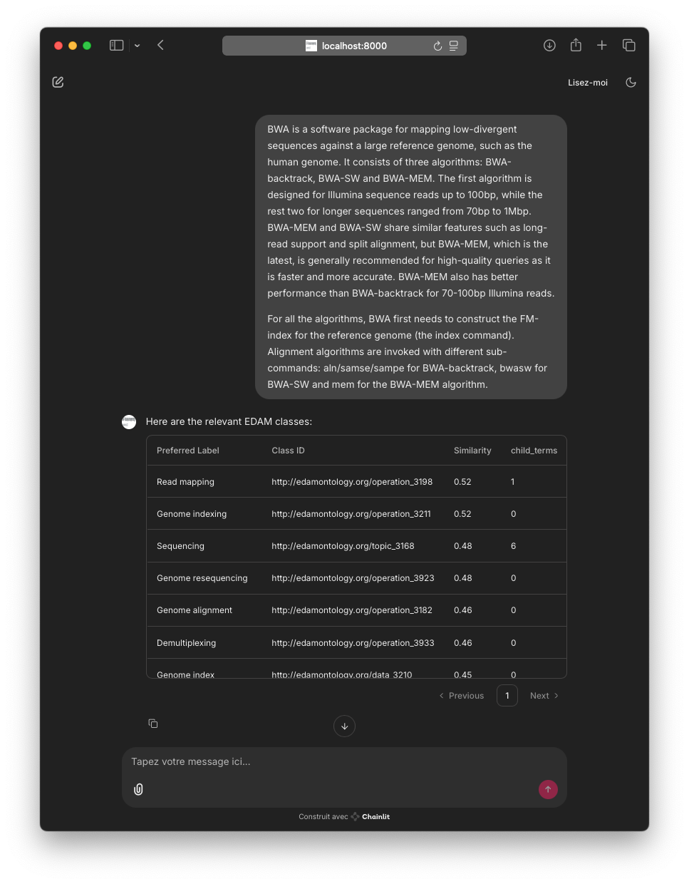

# EDAM-Terms-Reco

## Overview
EDAM-Terms-Reco is a tool designed to assist researchers and developers in identifying and recommending relevant EDAM ontology terms for bioinformatics resources, workflows, and datasets. The project aims to improve metadata annotation and interoperability in the life sciences. 

This is an early prototype and a work in progress. The tool has not been yet validated against any ground truth. 

## Features
- Automatic recommendation of EDAM ontology terms based on input data or descriptions
- User-friendly web interface for manual term selection and review

*Possible future works*
- Command line interface
- RESTful API 
- Export recommended terms in standard formats

## Installation

### Prerequisites
- Python 3.12+
- pip, uv

### Steps
1. Clone the repository:
    ```bash
    git clone https://github.com/yourusername/edam-terms-reco.git
    cd edam-terms-reco
    ```
2. Create a virtual environment for the required python packages 
    ```bash
    uv venv edam-terms-reco
    source edam-terms-reco/bin/activate
    ```
3. Install dependencies:
    ```bash
    uv pip install 'numpy<2' pandas chainlit faiss-cpu rdflib 'sentence-transformers[torch]'
    ```
4. Start the web interface:
    ```bash
    chainlit run main.py
    ```

## Usage

### Web Interface
Open your browser and navigate to `http://localhost:8000` to use the graphical interface.

### Demo 
The following screenshot showcase how relevant EDAM ontology terms can be suggested based on a textual desciprition provided by the BWA tool man page. A small transformer model ([all-MiniLM-L6-v2](https://huggingface.co/sentence-transformers/all-MiniLM-L6-v2)) is used to compute the top-10 closests ontology classes, logical reasoning on the ontology hierarchy is used to count the number of more specific terms. This indicates here that the "Sequencing" term could be replaced by more specific terms.  


## Contributing
Contributions are welcome! Please follow these steps:
1. Fork the repository
2. Create a new branch (`git checkout -b feature-branch`)
3. Commit your changes
4. Submit a pull request

Please read the [CONTRIBUTING.md](CONTRIBUTING.md) for more details.

## License
This project is licensed under the MIT License. See the [LICENSE](LICENSE) file for details.